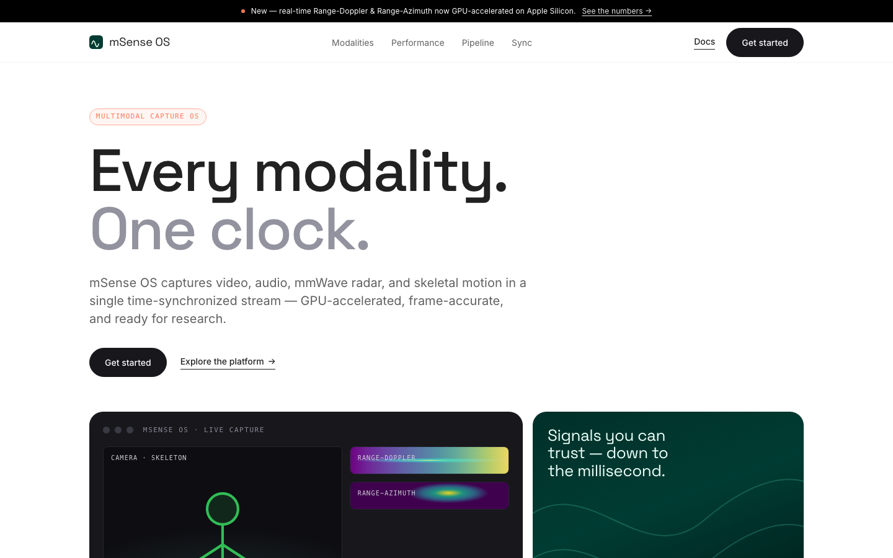

<div align="center">


# mSense OS

**Multimodal sensing, perfectly in sync.**

Video · Audio · mmWave radar · Skeleton — captured on one clock, GPU-accelerated and research-ready.

[](https://weixijia.github.io/mSense-OS/)
[](#tech-stack)
[](DESIGN.md)
[](LICENSE)



</div>

---

## Overview

This repository holds the **official website** for **mSense OS**, a multimodal sensing platform
that captures **video, audio, mmWave radar, and skeletal motion** in a single time-synchronized
stream. Each sensor runs on its own thread and lands on a shared timeline, so a frame of video,
a chirp of radar, and a skeletal pose all describe the same instant — GPU-accelerated,
frame-accurate, and ready to feed research and training pipelines.

The site is a fast, dependency-free static page that presents the platform, its four modalities,
the real-time performance story, and the capture → process → export pipeline.

## Modalities

| Modality | What it captures | Output |
|----------|------------------|--------|
| **Video** | High-resolution camera, up to 1080p / 30 fps, zero-copy live display | MP4 · per-frame RGB |
| **Audio** | Multi-channel recording, sample-aligned to the host clock | WAV · multi-channel |
| **mmWave radar** | Raw ADC from TI AWR/IWR radar → live Range-Doppler & Range-Azimuth | HDF5 · RD / RA |
| **Skeleton** | RGB-extracted 2D keypoints per person, overlaid live | JSON · x · y · confidence |

## Performance

The platform moves signal processing onto the GPU and **off the render loop**, so the interface
stays fluid while every frame is computed honestly — no dropped-frame interpolation.

| Metric | Result |
|--------|--------|
| Radar FFT | **5.5× faster** — 210 ms → 38 ms per frame on Apple Silicon (MPS), matched to CPU within ~2e-6 |
| Interface | **~30 fps** and never blocked — signal processing runs on its own thread |
| Capture | **Zero-loss** — an off-GIL receiver keeps up with the radar; only complete frames are kept |

## Tech stack

- **Static & dependency-free** — a single `index.html` plus `styles.css`. No build step, no framework.
- **Design system** — [`DESIGN.md`](DESIGN.md), a cohere-inspired reference: stark white editorial
  canvas, deep green-black product bands, monumental tight display type, rounded media cards,
  near-black pill CTAs, and coral editorial accents. **Read it before changing any UI.**
- **Typography** — Space Grotesk (display) + Inter (UI) via Google Fonts, with system fallbacks.

## Local development

No toolchain required — open `index.html` directly, or serve it locally:

```bash
git clone https://github.com/weixijia/mSense-OS.git
cd mSense-OS
python3 -m http.server 8000
# → http://localhost:8000
```

## Deployment

Any static host works (GitHub Pages, Netlify, Cloudflare Pages). For **GitHub Pages**:

```bash
# one-time, via the GitHub CLI
gh api -X POST repos/weixijia/mSense-OS/pages -f 'source[branch]=main' -f 'source[path]=/'
```

Or enable it in **Settings → Pages → Source: `main` / root**. The site is served from the
repository root.

## Project structure

```
mSense-OS/
├── index.html        # Single-page site: hero · modalities · performance · pipeline · sync · footer
├── styles.css        # Design tokens + components mapped from DESIGN.md
├── DESIGN.md         # Cohere-inspired design reference (keep in sync as the site evolves)
├── assets/
│   ├── hero.png      # README hero image
│   └── logo.svg      # Brand glyph
└── README.md
```

## Contributing

1. Read [`DESIGN.md`](DESIGN.md) — it is the source of truth for tokens, components, and tone.
2. Keep the site static and dependency-free; prefer semantic HTML and the existing CSS variables.
3. Preserve the type split (display vs. UI) and the flat, whitespace-led layout.

## License

Released under the [MIT License](LICENSE).
